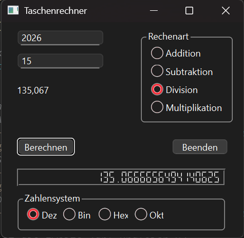

# Qt Safe Calculator

Desktop calculator developed with **C++ and Qt** featuring input validation and exception handling.

## Features

- Addition
- Subtraction
- Multiplication
- Division
- Input validation
- Exception handling
- Qt graphical interface

## Technologies

- C++
- Qt
- Object-Oriented Programming
- Exception Handling
- Qt Widgets

## Screenshot

## Author

Armel Toukam
